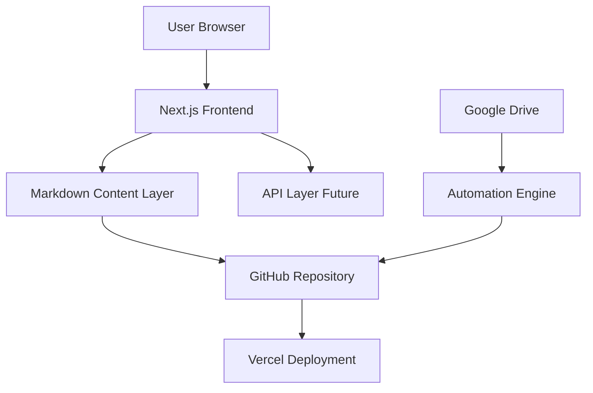
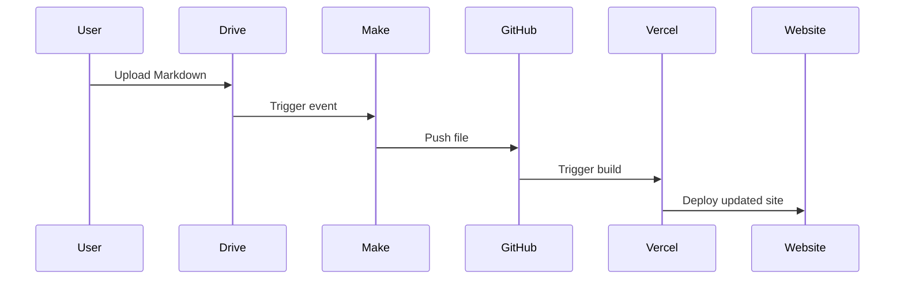
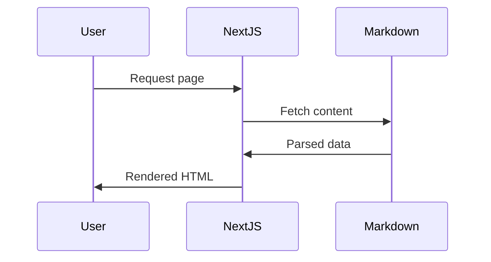
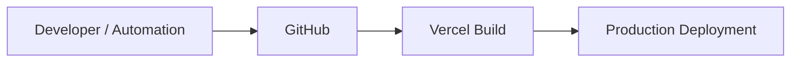

# 🏗️ SYSTEM DESIGN DOCUMENT (SDD)

## AI Prompt & Workflow Platform

---

# 1. 📌 INTRODUCTION

## 1.1 Purpose

This document defines the **technical architecture, system components, data flow, and design decisions** for building a scalable AI Prompt & Workflow platform.

---

## 1.2 Scope

The system will:

* Serve prompt and workflow content
* Enable fast content updates via Markdown
* Support SEO and high performance
* Be extensible to SaaS features (auth, payments, marketplace)

---

## 1.3 Design Principles

* **Modularity** (plug-and-play architecture)
* **Scalability-first design**
* **Separation of concerns**
* **Performance optimization (SSG/ISR)**
* **Developer experience (DX)**
* **SEO-first structure**

---

# 2. 🧠 HIGH-LEVEL ARCHITECTURE



---

# 3. 🧱 SYSTEM ARCHITECTURE

## 3.1 Layered Architecture

```mermaid
graph TD

UI[Presentation Layer] --> BL[Business Logic Layer]
BL --> DL[Data Layer]

UI --> Components
BL --> Services
DL --> Markdown Files / Future DB
```

---

## 3.2 Architecture Style

* Static-first (SSG)
* Hybrid rendering (SSG + ISR)
* API-ready (future backend integration)

---

# 4. 🛠️ TECH STACK

## 4.1 Frontend

* Next.js (App Router)
* TypeScript
* Tailwind CSS

---

## 4.2 Content Layer

* Markdown (.md files)
* gray-matter (frontmatter parsing)
* remark / rehype (content rendering)

---

## 4.3 Deployment

* Vercel (CI/CD + hosting)
* GitHub (version control)

---

## 4.4 Automation (Optional)

* Google Drive (content input)
* Make (automation pipeline)

---

## 4.5 Future Stack

* Supabase (DB + Auth)
* Stripe (payments)

---

# 5. 📁 PROJECT STRUCTURE

```
/content/
  prompts/
  workflows/

/app/
  prompts/[slug]/
  workflows/

/components/
  ui/
  cards/
  layout/

/lib/
  markdown-parser.ts
  seo.ts

/utils/
  helpers.ts
```

---

# 6. 🔄 DATA FLOW

## 6.1 Content Flow



---

## 6.2 Runtime Flow



---

# 7. 📦 DATA MODEL

## 7.1 Prompt Schema

```yaml
title: string
description: string
image: string
tags: string[]
created_at: date
```

---

## 7.2 Workflow Schema

```yaml
title: string
description: string
steps:
  - step: string
```

---

# 8. ⚙️ CORE COMPONENTS

## 8.1 Markdown Parser

* Parses frontmatter
* Converts content to HTML

## 8.2 Routing System

* Dynamic routing via slug
* File-based routing

## 8.3 UI Components

* Prompt Card
* Workflow Card
* Layout Components

## 8.4 Utility Layer

* Copy-to-clipboard
* Slug generator
* SEO metadata handler

---

# 9. 🚀 PERFORMANCE OPTIMIZATION

* Static Site Generation (SSG)
* Incremental Static Regeneration (ISR)
* Image optimization
* Lazy loading
* Code splitting

---

# 10. 🔍 SEO ARCHITECTURE

* Dynamic meta tags
* OpenGraph support
* Clean URLs
* Structured data (JSON-LD)

---

# 11. 🔐 SECURITY CONSIDERATIONS

* No sensitive data in MVP
* Sanitized markdown rendering
* Rate limiting (future APIs)

---

# 12. 🔄 CI/CD PIPELINE



---

# 13. 📈 SCALABILITY ROADMAP

## Phase 1

* Static content (Markdown)
* No backend

## Phase 2

* Add API routes
* Add database (Supabase)

## Phase 3

* Authentication
* Premium content
* Payments

## Phase 4

* Marketplace
* User-generated content

---

# 14. 🧩 EXTENSIBILITY DESIGN

* Plug-and-play modules
* API abstraction layer
* Feature toggles for premium features

---

# 15. ⚠️ RISKS & MITIGATIONS

## Risk: Content scaling issues

→ Solution: Move to database

## Risk: Monetization failure

→ Solution: Focus on workflows + services

## Risk: Performance bottlenecks

→ Solution: ISR + caching

---

# 16. 🧠 DESIGN DECISIONS

| Decision             | Reason                                |
| -------------------- | ------------------------------------- |
| Next.js              | Scalability + freelancing credibility |
| Markdown             | Simplicity + speed                    |
| Vercel               | Zero-cost deployment                  |
| Modular architecture | Future extensibility                  |

---

# 17. ✅ CONCLUSION

This system is designed to:

* Launch fast (MVP)
* Scale into SaaS
* Support monetization
* Showcase engineering capability

---

# 🚀 FINAL NOTE

This is not just a website.

It is a **foundation for a scalable AI product ecosystem**.
